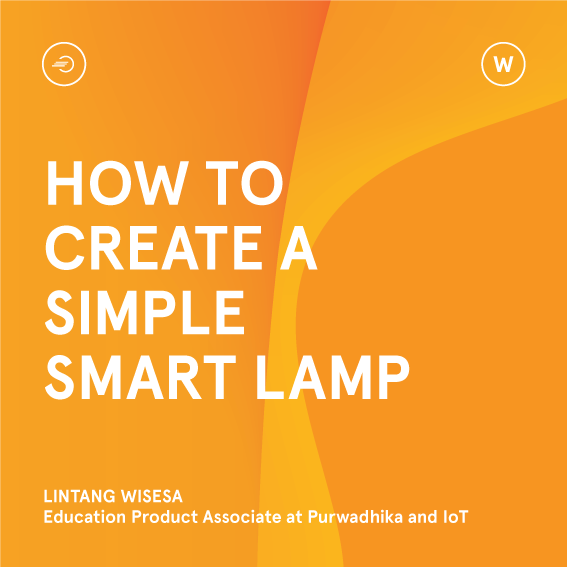

# **Workshop How to Create a Simple Smart Lamp**

## **About This Workshop :mega:**

  The __*IoT (Internet of Things)*__ extends internet connectivity beyond traditional devices like laptop & smartphones to a diverse range of devices that utilize embedded technology to communicate and interact with the external environment. All via the Internet. Examples of objects that can fall into the scope of IoT include connected security systems, thermostats, cars or lights in household.

  The _**ESP8266**_ is a low cost IoT chip from **_Espressif (China)_**, as a new generation of IoT hardware trends. First published on August 2014, this tiny WiFi chip has a small processor onboard, so it can actually function in complete autonomy, without an additional microcontroller board. It makes the ESP8266 the perfect piece of hardware for makers & IoT beginners. 
  
  In this workshop, we’ll stick to the basics IoT project. We will see how to configure the chip, and finally how to connect it to your WiFi network. We’ll simply be using the ESP8266 development board (NodeMCU), Arduino IDE to program it & also several IoT platforms to control & monitor the ESP8266.

#

## **What Should You Bring :mega:**

  - :computer: A laptop _**(Windows/MacOS/Linux)**_.
  - :iphone: A smartphone **_(Android/iOS)_**.
  - :electric_plug: A micro USB cable **_(smartphone USB charger)_**.

#

## **What Will You Get :gift:**

  - :wrench: ESP8266 IoT mini starter kit.
  - :hamburger: Snack & lunch.
  - :mortar_board: Digital certificate.

#

## **What Will You Learn :memo:**

  No.|Material|Tutorial
  -----|-----|-----
  0.|Setup _**(please do this before the workshop)**_ :point_right:|*__[click here](https://github.com/LintangWisesa/LSTP-Workshop-IoT-ESP8266/tree/master/0_Setup)__*
  1.|Hello World!|*__[click here](https://github.com/LintangWisesa/LSTP-Workshop-IoT-ESP8266/tree/master/1_Hello_World)__*
  2.|Digital & Analog Output|_**[click here](https://github.com/LintangWisesa/LSTP-Workshop-IoT-ESP8266/tree/master/2_Digital_Analog_Output)**_
  3.|Digital & Analog Input|_**[click here](https://github.com/LintangWisesa/LSTP-Workshop-IoT-ESP8266/tree/master/3_Digital_Analog_Input)**_
  4.|Analog & Digital I/O|_**[click here](https://github.com/LintangWisesa/LSTP-Workshop-IoT-ESP8266/tree/master/4_Digital_Analog_Input_Output)**_
  5.|ESP8266 & LDR Sensor|_**[click here](https://github.com/LintangWisesa/LSTP-Workshop-IoT-ESP8266/tree/master/5_ESP8266_LDR)**_
  6.|ESP8266 WiFi Scanner|_**[click here](https://github.com/LintangWisesa/LSTP-Workshop-IoT-ESP8266/tree/master/6_ESP8266_WiFi_Scanner)**_
  7.|Connecting ESP8266 to A WiFi Network|_**[click here](https://github.com/LintangWisesa/LSTP-Workshop-IoT-ESP8266/tree/master/7_Connect_to_A_WiFi)**_
  8.|ESP8266 & Blynk|_**[click here](https://github.com/LintangWisesa/LSTP-Workshop-IoT-ESP8266/tree/master/8_ESP8266_Blynk)**_
  9.|ESP8266 & Thinger.io|_**[click here](https://github.com/LintangWisesa/LSTP-Workshop-IoT-ESP8266/tree/master/9_ESP8266_Thinger)**_

  :exclamation: _**Note.**_ Please read & do the _**first material**_ before the workshop is being held.

#

#### Lintang Wisesa :love_letter: _lintangwisesa@ymail.com_

[Facebook](https://www.facebook.com/lintangbagus) | 
[Twitter](https://twitter.com/Lintang_Wisesa) |
[Google+](https://plus.google.com/u/0/+LintangWisesa1) |
[Youtube](https://www.youtube.com/user/lintangbagus) | 
:octocat: [GitHub](https://github.com/LintangWisesa) |
[Hackster](https://www.hackster.io/lintangwisesa)
